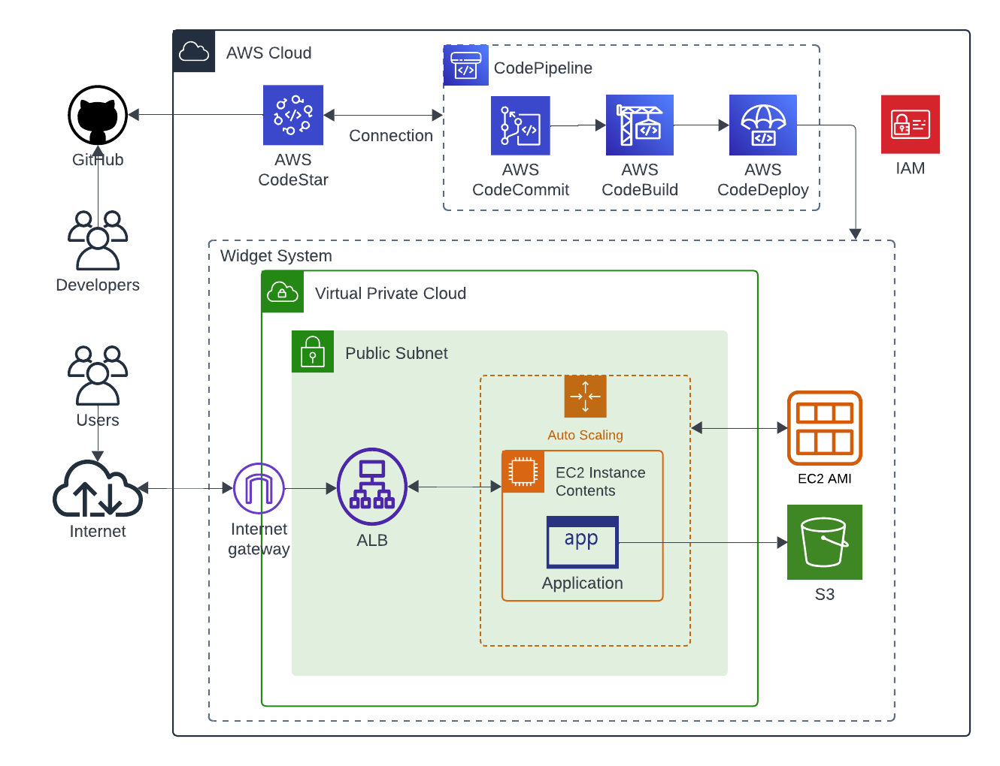

const readmeContent = `
# Widget CDK Stack

This project sets up and deploys an AWS infrastructure using AWS CDK, including an Auto Scaling Group, an Application Load Balancer, and a CI/CD pipeline with test stages. The infrastructure is defined in WidgetCdkStack, while the CI/CD pipeline is managed by WidgetCicdStack.

## Project Structure

- **WidgetCdkStack**: Defines the infrastructure with an EC2 Auto Scaling Group, security group, and an Application Load Balancer (ALB).
- **WidgetCicdStack**: Sets up a CodePipeline CI/CD pipeline for deploying the WidgetCdkStack, with pre-deployment steps for unit and integration testing.

## Requirements

- Node.js (>= 14.x)
- AWS CLI
- AWS CDK
- AWS CodeStar connection for GitHub

### Environment Variables

Ensure that you have a .env file with the following content:

```
ACCOUNT_ID=<AWS_ACCOUNT_ID>
REGION=<AWS_REGION>
```

## Deployment Steps

1. **Install Dependencies**
```bash
npm install
```

2. **Bootstrap CDK**
This step ensures the environment is set up for deploying the stack.
```bash
cdk bootstrap
```

3. **Deploy Stack**
Deploy the Widget CDK Stack.
```bash
cdk deploy WidgetCdkStack
```

4. **Deploy Pipeline**
Deploy the Widget CICD Pipeline stack, which will handle the automated deployment and testing of the infrastructure.
```bash
cdk deploy WidgetCicdStack
```

## Code Explanation

### WidgetCdkStack

1. **VPC Setup**
Retrieves the default VPC and configures the environment for the stack.

2. **IAM Role**
Creates an IAM role for EC2 instances in the Auto Scaling Group with ec2.amazonaws.com as the assumed service principal.

3. **Security Group**
Defines a security group with rules allowing HTTP and HTTPS traffic from any IP address.

4. **Launch Template**
Defines an EC2 launch template using a specific AMI for instance provisioning.

5. **Auto Scaling Group**
Creates an Auto Scaling Group with min capacity of 1 and max capacity of 3 instances.

6. **Application Load Balancer**
Sets up an ALB and configures an HTTP listener on port 80.

7. **Target Group**
Adds an Auto Scaling Group as a target with health checks.

### WidgetCicdStack

1. **CodePipeline**
Sets up a pipeline for continuous integration and deployment. Uses GitHub as the source and synthesizes the stack using AWS CodeBuild.

2. **Unit Test Step**
A CodeBuild step that runs npm test to verify unit tests.

3. **Integration Test Step**
A CodeBuild step that runs integration tests with npm run integ-test.


## Clean Up

To delete the deployed stacks and resources, run:
```bash
cdk destroy WidgetCdkStack
cdk destroy WidgetCicdStack
```

## License

This project is licensed under the MIT License.

## System Architecture


## Prerequisites
To manage and deploy this stac, you will need the following:
- AWS CDK installed ([CDK Installation](https://docs.aws.amazon.com/cdk/latest/guide/getting_started.html))
- AWS CLI configured with your AWS credentials that have permissions to deploy resources
- Node.js (v14 or later)
- CodeStar connection set up to GitHub repository


## Run app
Please make sure you have created repository using aws cdk before pull this repository.
Once you've got repository, take following steps to run app

```bash
npm install
npm run build
cdk bootstrap (You might need to configure your account)
cdk synth
cdk deploy
```